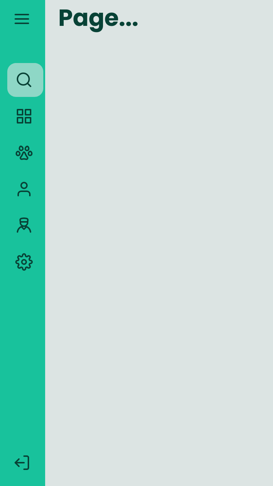
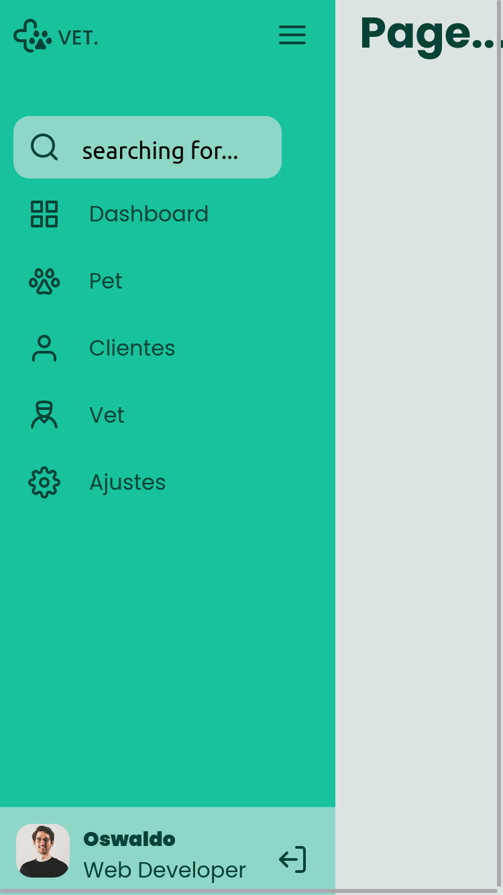

# Desafio Sidebar :hamburger:

## Sobre o projeto :information_source:

Esse projeto foi tirado de um dos desafiso do Discover, da plataforma [Rocketseat](https://app.rocketseat.com.br/discover).

Um projeto que tem como objetivo mostrar opções de um menu através de uma _sidebar_.

Para mais detalhes sobre o projeto você pode conferir clicando [AQUI](https://app.rocketseat.com.br/discover/challenges/sidebar).

---

## Tecnologias :wrench:

As tecnologias usadas foram:

- HTML
- CSS
- JavaScript

---

## Preview :computer:

Acesse a página: [**Desafio Sidebar**](https://matheus-lincon.github.io/sidebar/)

